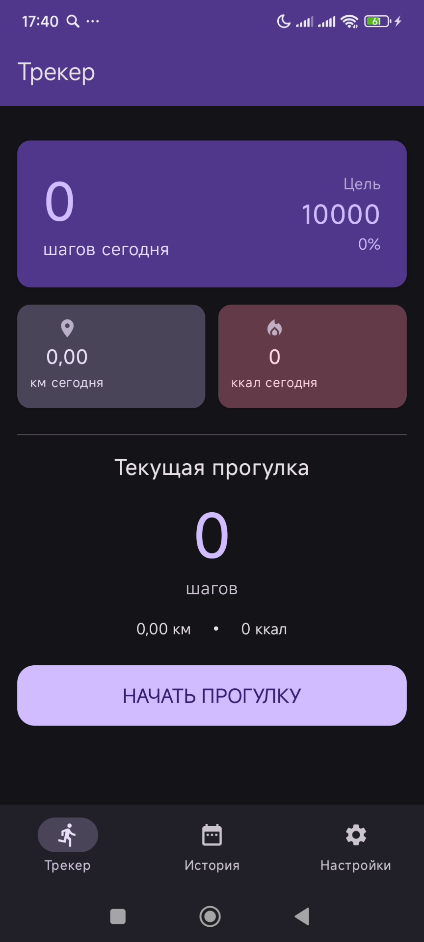
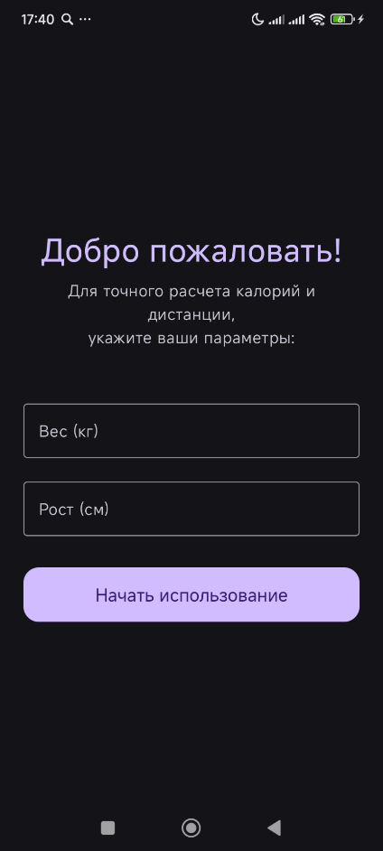
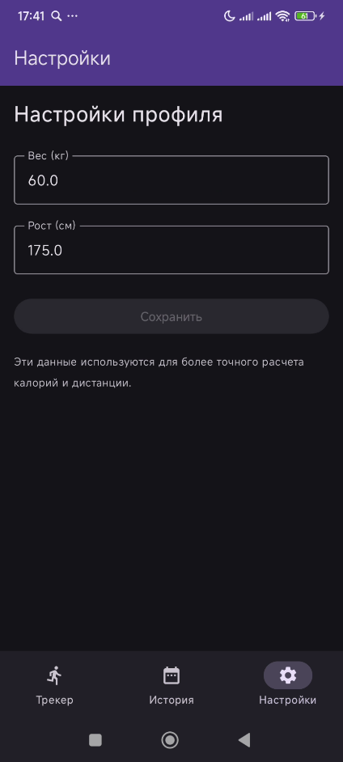

# 🏃‍♂️ JetFit (Android)

Простое и удобное приложение для отслеживания физической активности, написанное на **Kotlin** с использованием **Jetpack Compose**. Приложение считает шаги, рассчитывает пройденную дистанцию и сожженные калории, а также сохраняет историю тренировок.

## 📱 Скриншоты


| Главный экран | Приветственный экран | Настройки |
| :---: | :---: | :---: |
|  |  |  |

## ✨ Основные возможности

- **Подсчет шагов в реальном времени:** Использование датчика `TYPE_STEP_COUNTER`.
- **Индивидуальные расчеты:** Расчет калорий и дистанции на основе веса и роста пользователя.
- **История тренировок:** Сохранение данных за каждый день с разбивкой по сессиям.
- **Локальное хранение:** Использование **Jetpack DataStore** для надежного сохранения данных.
- **Адаптивный интерфейс:** Поддержка светлой и темной темы (Dark Mode).
- **Onboarding:** Экран первичной настройки параметров пользователя при первом запуске.
- **Анимации:** Плавные переходы между экранами и анимация счетчиков.

## 🛠 Технологии и библиотеки

- **Язык:** Kotlin
- **UI Toolkit:** Jetpack Compose (Material 3)
- **Архитектура:** MVVM (Model-View-ViewModel)
- **Хранение данных:** Jetpack DataStore (Preferences)
- **Асинхронность:** Kotlin Coroutines & Flow
- **Навигация:** Custom State-based Navigation

## 🚀 Как запустить проект

1. Клонируйте репозиторий в Android Studio:
   ```bash
   https://github.com/BZTZR/JetFit.git
2. Скомпилируйте проект через ADB или сформируйте .apk файл
